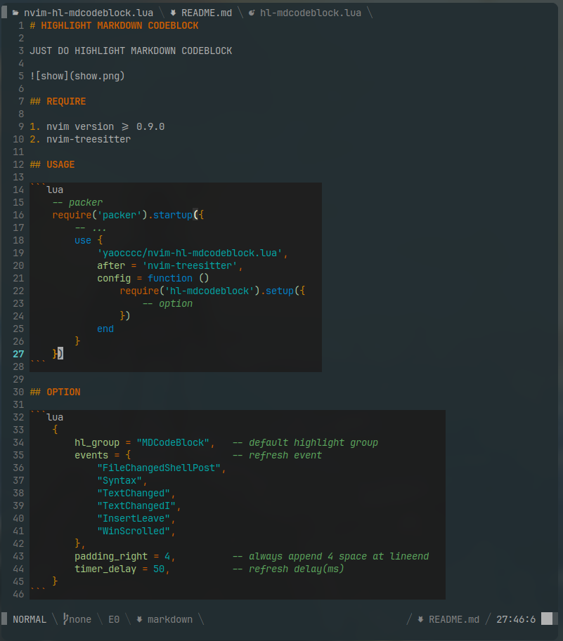

# HIGHLIGHT MARKDOWN CODEBLOCK

JUST DO HIGHLIGHT MARKDOWN CODEBLOCK



## REQUIRE

1. nvim version >= 0.9.0
2. nvim-treesitter

## USAGE

```lua
    -- packer
    require('packer').startup({
        -- ...
        use {
            'yaocccc/nvim-hl-mdcodeblock.lua',
            after = 'nvim-treesitter',
            config = function ()
                require('hl-mdcodeblock').setup({
                    -- option
                })
            end
        }
    })
```

## OPTION

```lua
    {
        hl_group = "MDCodeBlock",   -- default highlight group
        events = {                  -- refresh event
            "FileChangedShellPost",
            "Syntax",
            "TextChanged",
            "TextChangedI",
            "InsertLeave",
            "WinScrolled",
            "BufEnter",
        },
        padding_right = 4,          -- always append 4 space at lineend
        timer_delay = 20,           -- refresh delay(ms)
        query_by_ft = {             -- special parser query by filetype
            markdown = {            -- filetype
                'markdown',         -- parser
                '(fenced_code_block) @codeblock', -- query
            },
            rmd = {                 -- filetype
                'markdown',         -- parser
                '(fenced_code_block) @codeblock', -- query
            },
        },
        minumum_len = 100,            -- minimum len to highlight (number | function)
        -- minumum_len = function () return math.floor(vim.o.columns * 0.8) end
    }
```
